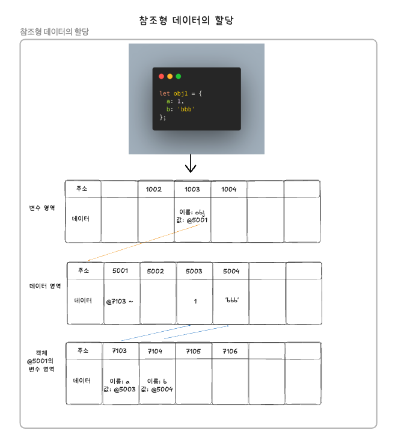

## 데이터 타입

---

### 1. 데이터 타입의 종류
JS의 데이터 타입에는 크게 **기본형(Primitive Tye,원시 타입)과 참조형(Reference Type, 객체 타입) 2가지**로 구분됩니다.

ES6에서 변화점
- 원시 타입에 Symbol이 추가됨
- 객체 타입에 Map,WeakMapo,Set,WeakSet 등이 추가됨

**자바스크립트의 데이터 타입**


<br/>

**기본형과 참조형의 구분**

기본형
- 할당이나 연산시 값의 주소를 복제함
- 값이 불변성을 뜸

참조형
- 할당이나 연산시 값의 주소를 참조함
- 값이 참조성을 뜸

<br/>

### 2.데이터 타입에 관한 배경 지식

**메모리와 데이터**
- 비트 = 0과 1로 표현
- 바이트 = 8bit의 묶음

**-> 모든 데이터는 바이터 단위의 식별자(메모리 주솟값)을 통해 서로 구분하고 연결할 수 있음**


**식별자와 변수**
- 변수 = 변할 수 있는 수를 의미함(let)
- **변수명 = 식별자(데이터를 식별하는데 사용하는 이름) = x**
- 데이터 = 20

```JavaScript
let x = 20;
```

<br/>

### 3. 변수 선언과 데이터 할당

**변수 선언**
- **변경 가능한 데이터가 담길 수 있는 공간을 확보한다**를 의미함
- 1003번 메모리 주소의 이름을 a라고 지정함


**데이터 할당**
- 변수 선언과 데이터 할당을 구분지어하거나 한 줄로 초기화 하거나 JS엔진은 동일한 동작을 수행함
- **메모리에 빈 공간을 확보하고 나서, 해당 공간에 값의 주소를 대입함**

-> **이후 동일한 값이 든 변수가 있을 시, 해당 값의 주소만 가지고 있으면 되기 때문**

메모리 영역 : 변수를 구분하기 위한 공간
데이터 영역 : 변수의 데이터를 가지고 있는 영역
- 변수 a에는 문자열 'abc' 값 대신 'abc'의 주소 값을 가지고 있음
1. 변수 영역에서 빈 공간(@1003)을 확보함
2. 확보한 공간의 식별자를 a라고 지정함
3. 데이터 영역의 빈 공간(@5004)에 문자열 'abc'를 지정함
4. 변수 영역에서 a라는 식별자를 검색함(@1003)
5. 앞서 저장한 문자열의 주소(@5004)를 @1003의 공간에 대입함


**문자열 변환에 따른 메모리 영역의 변화**
- 변경 이전의 문자열 'abc'의 값은 그대로 데이터 영역에 존재하고, 데이터 영역에 새로운 공간(@5005)에 변경된 문자열 'abcdef'를 넣고 값의 메모리 영역에 할당함


<br/>

### 4. 기본형 데이터와 참조형 데이터
**불변값**

상수와 불변값의 구분

변수
- 변경될 수 있는 값

상수
- 변경될 수 없는 값

**변수와 상수의 구분 기준**
- **변수 영역의 메모리**
- 한번 데이터 할당이 이루어진 변수 공간에 다른 데이터를 재할당할 수 있는지 여부

**불변값의 구분 기준**
- **데이터 영역의 메모리**

**기본형 데이터 = 불변성 특성을 가짐**
- 기본형인 숫자, 문자열, boolean, null, undefined, Symbol은 모두 불변값
- 변수 a에 저장된 데이터 영역의 'abc'의 값은 데이터 영역에 그대로 존재하고, 'abcdef'라는 새로운 값을 데이터 영역에 만들어 해당 값의 주소를 변수 a에다가 할당함
- 변수 b에 저장된 데이터 영역의 5를 새로운 데이터 영역에 만들고, 해당 데이터 영역의 값을 재사용하여 변수 c에 할당함
- 변수 b의 값이 7로 변경될 경우, 데이터 영역에 7을 새로운 값을 추가하고, 기존 5의 주소 대신 7의 데이터 주소를 연결함

```JavaScript
let a = 'abc';
a = a + 'def';

let b = 5;
let c = 5;
b = 7;
```
<br/>

**정리**
- 원시 타입은 기존 데이터 영역의 값은 그대로 존재하고, 새로운 값이 생길 때 해당 데이터를 새로 생성하여 변수에 연결함

-> 불변성의 특징

-> 이전에 만들어진 값은 가비지 컬렉션이 해당 영역의 값을 수거함
<br/>

**가변값**

참조형 데이터는 대부분 가변 값인 경우가 많지만, 설정에 따라 변경 불가능한 경우(Object.defineProperty,Object.freeze 등)도 있고
아예 불변값(불변 객체)로 활용하는 방안이 있습니다.


**참조형 데이터의 할당**
1. 변수 영역의 빈 공간 확보(@1002), 해당 주소의 이름을 obj1으로 지정
2. 객체의 변수를 저장하기 위한 별도의 변수 영역 지정(@7103 ~)하고, 해당 주소의 이름을 @5001에 저장
3. 객체의 변수 영역에 a와 b라는 프로퍼티 이름을 지정
4. 데이터 영역에서 값을 검색해 없을 경우 1과 'bbb'를 추가하고, 해당 주소의 이름(@5001,@5002)을 객체의 프로퍼티 값(@7103,@7104)에 저장


<br/>

**기본형과의 차이점**
- 객체의 변수(프로퍼티)영역이 별도로 존재하며, 기존의 데이터 영역은 그대로 사용함<br/>
-> 데이터 영역의 값은 모두 불변값이며, 객체가 별도의 프로퍼터 영역을 가지고 있기 때문에 얼마든지 값을 변경할 수 있음
-> 때문에 참조형 데이터는 가변값이라고 함


**참조형 데이터의 프로퍼티 재할당**
- 기존 obj1의 a 프로퍼티의 값은 데이터 영역에 그대로 존재하고, obj1의 a 프로퍼티 값을 2인 주소(@5005)로 재연결합니다.

-> **새로운 객체가 만들어진 것이 아닌 객체 내부의 값만 변경됨**


<br/>

**중첩된 참조형 데이터(객체)의 프로퍼티 할당**
- 참조형 프로퍼티에 다시 참조형 데이터를 할당하는 경우 = 중첩 객체(Nested Object)라고 함
1. 빈 변수 영역에 obj의 공간을 확보함
2. 데이터 저장 영역인 (@5001)에 해당 객체의 데이터 저장을 위한 영역을 확보하고, 해당 객체의 값을 위한 별도의 변수 영역(@7103 ~)을 마련합니다.
3. 객체 obj의 변수 영역에 데이터 값의 변수명과 데이터 저장을 위한 주소(@5002)를 설정함
4. @7103에 배열의 이름인 arr과 배열의 배열의 값을 저장하기 위한 별도의 공간을 확보함
5. 배열 arr의 변수 영역에서 데이터 영역에 값을 검색한 다음 값을 찾아 할당함(@8104,@8105,@8106)


**중첩된 참조형 데이터(객체)의 프로퍼티 재할당**
- 문자열 'str'을 저장하고 해당 데이터의 주소의 값을 7104에 할당합니다. 
<br/>

**참조 카운트**
- 어떤 데이터 영역에서 주소를 자신의 참조하는 변수의 갯수를 참조 카운트라고 함
- 참조 카운트가 0인 메모리 주소는 GC의 수거 대상이 되며, 런타임 환경에 따라 특정 시점 혹은 메모리 사용량이 포화될 때마다 자동으로 수거됨


<br/>

**변수 복사 비교**
기본형 변수 복사
- 변수 영역에 a,b라는 식별자를 붙인 후, 해당 값에 10의 데이터 영역의 주소(@5001)을 주입함

<br/>

참조형 변수 복사
- 변수에 obj1이라는 식별자 생성후, 해당 객체의 변수 영역에 c와 d라는 식별자를 붙임
- 식별자를 붙인 후, 데이터 영역에서 10과 'ddd'의 주소를 해당 객체의 값에 주입함(@7103,@7104)
- 변수 obj2라는 식별자 생성 후, obj1의 객체의 변수 영역 주소를 값에 주입함(@5001)


**변수 복사 이후 값 변경 비교 - 객체 프로퍼티 변경 시**

기본형 변수 복사
- 변수 영역의 b의 식별자 생성 후, 변경 시 값의 주소가 달라짐(@5001 -> @5004)

-> 데이터 영역에 새로운 값을 추가 후, 주소 할당

참조형 변수 복사
- 변수 영역의 obj2의 식별자 생성 후, 변경 시 값의 주소가 달라지지 않음(@5002)

-> obj1 객체의 변수 영역이 별도로 존재하여, 데이터 영역에 새로운 값을 추가 후 주소 할당 (@7103 -> @5005)


<br/>

**정리**

- 변수 a와 b는 서로 다른 주소를 바라보지만, 변수 obj1과 obj2는 같은 객체를 바라봄
```JavaScript
a !== b
obj1 === obj2 
```

**변수 복사 이후 값 변경 비교 - 객체 자체 변경 시**
- obj2의 메모리 영역에 새로운 객체를 할당함으로 직접 변경시, obj2의 변수 영역의 데이터 주소 값도 변경됩니다.


<br/>

**정리**
- 참조형 데이터가 가변값을 가진다고 설명할 때, 가변은 참조형 데이터 자체(객체 자체)를 변경할 경우가 아닌 해당 내부의 프로퍼티(속성 값)을 변경할 때만 성립합니다. 

<br/>

### 5. 불변 객체

**불변 객체를 만드는 간단한 방법**

앞서 살펴봤듯이 참조형 데이터의 '가변'은 데이터 자체가 아닌 내부 프로퍼티를 변경할 때만 성립합니다.
데이터 자체를 변경하고자 하면 기본형 데이터와 마찬가지로 기존 데이터는 변경되지 않습니다.

-> 내부 프로퍼티를 변경할 필요가 있을 때마다 매번 새로운 객체를 만들어 재할당하기로 규칙을 정하거나, 자동으로 새로운 객체를 만드는 도구를 확보해야 합니다.

값으로 전달받은 객체에 변경을 가하더라도 원본 객체는 변하지 않아야 하는 경우가 종종 생기며, 이때 불변 객체가 필요 합니다.


**객체의 가변성에 의한 문제점**

- 먼저 user 객체를 생성하고, user 객체의 name 프로퍼티를 'Jung'으로 변경하는 함수 changeName을 호출하여 user2 변수에 담음
- user 변수와 user2 변수가 서로 같지 않다는 조건이 성립되면 변경되었음을 출력하지만, 실제로는 출력없이 통과함
- 두 변수의 name 프로퍼티 모두 'Jung'으로 출력되고, 두 변수가 동일하게 여겨지기 때문

-> 정보가 변경된 시점을 알리거나, 변경전과 변경 후의 정보를 가시적으로 보여줘야 할 경우에는 문제가 발생할 수 있음

```JavaScript
const user = {
  name: 'Jaenam',
  gender: 'male',
};

const changeName = (user, newName) => {
  const newUser = user;
  newUser.name = newName;
  return newUser;
}

cosnt user2 = changeName(user, 'Jung');

if(user !== user2){
  console.log('유저 정보가 변경되었습니다.');
}

console.log(user.name, user2.name); //Jung Jung
console.log(user === user2); //true
```

<br/>

**객체의 가변성에 따른 문제점의 해결 방법**
- changeName 함수가 새로운 객체를 반환하도록 수정함
- user와 user2는 서로 다른 객체임으로 변경 전과 후를 비교할 수 있음
- 하지만 이런 방법은 대상 객체에 정보가 많을 수록, 변경해야 할 정보가 많으므로 사용자가 입력하는 수고가 늘어남

-> 해당 방식보다는 대상 객체의 프로퍼티 갯수에 상관 없이 모든 프로퍼티를 복사하는 함수를 만드는 편이 더 좋음

```JavaScript
const user = {
  name: 'Jaenam',
  gender: 'male',
};

const changeName = (user, newName) => {
  return {
    name: newName,
    gender: user.gender
  };
}

cosnt user2 = changeName(user, 'Jung');

if(user !== user2){
  console.log('유저 정보가 변경되었습니다.');
}

console.log(user.name, user2.name); //Jaenam Jung
console.log(user === user2); //false
```

<br/>

**기존 정보를 복사해서 새로운 객체를 반환하는 함수(얕은 복사)**
- copyObject는 for in 문법을 이용하여 result 객체에 target 객체의 프로퍼티를 복사하는 함수

```JavaScript
const copyObject = target => {
    const result = {};
    for(const prop in target) {
        result[prop] = target[prop];
    }
    return result;
};
```
<br/>

**copyObject를 이용한 객체 복사(얕은 복사)**
- 간단하게 객체를 복사하고 내용을 수정함

```JavaScript
const user = {
    name: 'Jaenam',
    gender: 'male'
};

const user2 = copyObject(user);
user2.name = 'Jung';

if(user !== user2){
    console.log('유저 정보가 변경되었습니다.'); //유저 정보가 변경되었습니다.
}

console.log(user.name, user2.name); //Jaenam Jung
console.log(user === user2); //false

```
<br/>

프로퍼티 변경을 할 수 없게끔 시스템적으로 제약을 거둘기 위해 immutable.js, baobab.js 등의 라이브러리 자체에서 불변성을 지닌 별도의 데이터 타입과 그에 따른 메소드를 제공함
<br/>

**얕은 복사와 깊은 복사**
얕은 복사 = 바로 아래 단계의 값만 복사하는 방법
- 중첩된 객체에서 참조형 데이터가 저장된 프로퍼티를 복사할 때 해당 주솟값만 복사함

-> 해당 프로퍼티에 대한 원본과 사본이 모두 동일한 참조형 데이터의 주소를 가리키게 됨 <br/>
-> 사본을 변경하면 원본 데이터도 변경되고, 원본을 변경하면 사본도 변경됨

깊은 복사 = 내부의 모든 값들을 하나하나 찾아서 전부 복사하는 방법

- user2의 name 프로퍼티를 변경해도 user의 name의 프로퍼티는 병경되지 않음
- 반변 원본과 사본 중, urls 내부의 프로퍼티를 변경시에는 한쪽 값이 변경되면, 다른 한쪽의 값도 변경됨

-> 한 단계 더 들어간 urls 내부 프로퍼티들은 기존 데이터를 그대로 참조함
-> 해당 현상을 방지하기 위해 user.urls 프로퍼티에 대해서도 불변 객체로 만들필요가 있음

```JavaScript
const user = {
  name: 'Jaenam',
  urls: {
    portfolio: 'http://github.com/abc',
    blog: 'http://blog.com',
    facebook: 'http://facebook.com/abc'
  }
};

const user2 = copyObject(user);

user2.name = 'Jung';
console.log(user.name === user2.name); //false

user.urls.portfolio = 'http://portfolio.com';
console.log(user.urls.portfolio === user2.urls.portfolio); //true

user2.urls.blog = '';
console.log(user.urls.blog === user2.urls.blog); //true
```
<br/>

**중첩된 객체에 대한 깊은 복사**
- urls 프로퍼티에 copyObject함수를 실행하여 urls 프로퍼니 내부까지 새로운 데이터가 만들어짐

```JavaScript
const user2 = copyObject(user);
user2.urls = copyObject(user.urls);

user.urls.portfolio = 'http://portfolio.com';
console.log(user.urls.portfolio === user2.urls.portfolio); //false

user2.urls.blog = '';
console.log(user.urls.blog === user2.urls.blog); //false
```
<br/>

**정리**
- 객체 복사 시, 해당 객체의 프로퍼티가 기본형일 경우 그대로 복사(얕은 복사)를 해도 되지만, 참조형일 경우 다시 내부의 프로퍼티들을 복사(깊은 복사)를 해야 함

<br/>

**copyObject함수를 깊은 복사 방식으로 변경한 코드**
- target이 객체인 경우, 내부 프로퍼티를 순회하며 copyObjectDeep 함수를 재귀적으로 호출함
  - 함수가 아닌 경우 target을 그대로 지정하게끔 함

-> 해당 함수를 이용하여 객체를 복사한 다음 원본과 사본이 서로 완전히 다른 객체를 참조하게 되어 어느쪽의 프로퍼티를 변경하더라도 다른 쪽에 영향을 주지 않음

```JavaScript
const copyObjectDeep = (target) => {
    const result = {};
    if(typeof target === 'object' && target !== null) {
        for(const prop in target) {
            result[prop] = copyObjectDeep(target[prop]);
        }  
    } else {
    result = target;
    }
    return result;
};
```
<br/>

**깊은 복사 결과 확인**
```JavaScript
const obj = {
    a: 1,
    b: {
        c: null,
        d: [1,2]
    }
};

const obj2 = copyObjectDeep(obj);

obj2.a = 3;
obj2.b.c = 4;
obj2.b.d[1] = 3;

console.log(obj); //{ a: 1, b : { c: null, d: [1,3]}}
console.log(obj2); //{ a: 3, b: { c: 4, d: {0:1, 1:2}}}

```
<br/>

hasOwnProperty 메소드를 활용하여 프로토타입 체이닝을 통한 상속 프로퍼티를 복사하지 않게끔 할 수 도 있습니다.
ES5의 getter/setter를 복사하는 방법은 ES6의 Object.getOwnProperyDescriptor 또는 ES2017의 Object.getOwnPropertyDescriptors외엔 방법이 없음
<br/>

**깊은 복사를 처리할 수 있는 방법 - Json을 사용**
- 객체를 JSON 문법으로 표현된 문자열로 전환했다가 다시 JSON 객체로 변경하는 방식
- 메소드(함수)나 숨겨진 프로퍼티인 __proto__ 나 getter/setter 등과 같이 JSON으로 변경할 수 없는 프로퍼티들은 모두 무시함
- HttpRequest로 받은 데이터를 저장한 객체를 복사할 때 등 활용하기 좋은 방법

```JavaScript
const copyObjectViaJSON = (target) => JSON.parse(JSON.stringity(target));

const obj = {
    a: 1,
    b: {
        c: null,
        d: [1,2],
        func1: function() {console.log(3);}
        },
        func2: function() {console.log(4);}
};

const obj2 = copyObjectViaJSON(obj);

obj2.a = 3;
obj2.b.c = 4;
obj.b.d[1] = 3;

console.log(obj); //{a:1, b: { c: null, d: [1,3], func1: f() }, func2: f() }
console.log(obj2; //{a:3, b: { c: 4, d:[1,2]}}
```
<br/>

### 6. undefined와 null
JS에는 없음을 나타내는 undefined와 null 이 존재합니다.

undefined는 사용자가 직접 붙일 수 있지만, 추천하지 않으며 JS엔진이 다음과 같은 상황에서 반환합니다.
1. **값을 대입하지 않은 변수, 즉 데이터 영역의 메모리 주소를 지정하지 않은 식별자에 접근할 때**
2. **객체 내부의 존재하지 않는 프로퍼티에 접근하려고 할 때**
3. **return 문이 없거나 호출되지 않는 함수의 실행 결과**
<br/>

**자동으로 undefined를 부여하는 경우**
```JavaScript
let a;
console.log(a); //undefined = 값을 대입하지 않은 변수에 접근

const obj = {
    a : 1
};

console.log(obj.a); //1
console.log(obj.b); //undefined = 존재하지 않은 프로퍼티에 접근
console.log(b); //ReferenceError: b is not defined

const func = function() {};
const c = func(); 
console.log(c); //undefined = 반환값이 없을 경우
```
<br/>

배열의 경우 조금 다르게 undefined를 출력함

**undefined와 배열**
- arr1 = 빈 배열 생성 후 길이를 3으로 지정 -> [empty * 3] 출력
  - 배열에 3개의 빈 요소를 확보했지만, 해당 요소에 어떠한 값도 존재하지 않음
- new 연산자와 함깨 Array 생성자 함수 호출로 크기 3의 배열 생성 -> [empty * 3] 출력 
- 리터럴 방식으로 배열을 생성하면서, 각 요소에 undefind를 부여함 -> undefined, undefined, undefined 출력

```JavaScript
const arr1 = [];
arr1.length = 3;
console.log(arr1); //[empty * 3]

const arr2 = new Array(3);
console.log(arr2); //[empty * 3]

const arr3 = [undefined, undefined, undefined];
console.log(arr3); //undefined, undefined, undefined
```

**정리**
배열에서 '비어 있는 요소'와 'undefined를 할당하는 요소는 다름'
-> '비어 있는 요소'는 배열 메소드들의 순회 대상에서 제외됨

**빈 요소와 배열의 순회**
- arr1에는 undefined와 1을 할당
- arr2에는 빈 배열의 인덱스 1에 1을 할당

-> 배열의 각 요소를 순회하는 메소드들은 empty의 요소값인 '비어 있는 요소'의 값을 처리하지 않고 건너뜀

```JavaScript
const arr1 = [undefined, 1]; //0 undefind, 1 1
const arr2 = [];
arr2[1] = 1; //0 0 ,1 1

arr1.forEach((v,i) => {console.log(v,i);}); //undefined 0, 1 1
arr2.forEach((v,i) => {console.log(v,i);}); //1 1

arr1.map((v,i) => v + i;}); //[NaN,2]
arr1.map((v,i) => v + i;}); //[empty, 2]

arr1.filter( v => !v;}); //[undefined]
arr2.filter( v => !v;}); //[]

arr1.reduce((p,c,i) => p + c + i;}, ''); //undefined011
arr2.reduce((p,c,i) => p + c + i;}, ''); //11
```

**정리**
- JS엔진이 반환하는 undefined는 해당 프로퍼티 혹은 배열의 키값(인덱스)가 존재하지 않을 때입니다.
<br/>

**var와 let, const의 차이점**
JS엔진은 '값을 대입하지 않은 변수', 즉 데이터 영역의 메모리 주소를 지정하지 않은 식별자에 대해서 undefined를 할당합니다.
- var 변수는 environmentRecord가 인스턴스화될때 생성되면서 undefined로 초기화됩니다.
- ES6에서 등장한 let,const에 대해서는 undefined가 할당하지 않은 채로 초기화되며, 이후 실제 변수가 평가되기 전까지 해당 변수에 접근할 수 없음

-> "let과 const 변수는 environmentRecord가 인스턴스화도리 때 생성되지만, 실제 변수가 평가되기 전까지는 접근할 수 없음"이라고 설명됨
<br/>

null = 사용자가 데이터 영역의 연결을 끝고, 비어있음을 표기하기 위함
- typeof null은 object이며, 이는 JS 자체의 버그입니다.

-> 따라서 어떤 변수의 값이 null인지 판별하기 위해서는 동등(==) 연산자 말고, 일치 연산자(===)를 사용해야 합니다.
```JavaScript
const n = null;
console.log(typeof n); //object

console.log(n == undefined); //true
console.log(n == null); //true

console.log(n === undefined); //false
console.log(n === null); //true
```
